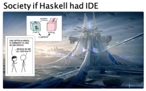

[Classes](#Classes): | About | Set up GHCi | Topic list | Sessions

[Reading](#Reading): | Top picks | Quick introductions | Longer reads | Other resources | Courses

|---------|-------|
| | > ... and a simple, straightforward way to read a CSV file. |

<!-- 
People cited:

@shumovichy, @BartoszMilewski, @fsoikin, @_bravit, @smdiehl, @carl_burch,
@alex_pir, @binroot
-->

# Classes

**About classes.** This is a curated introduction to Haskell by [Yuras Shumovich](https://twitter.com/shumovichy) as studied by [Evgeniy](https://twitter.com/PogrebnyakE) and [Zarak](https://github.com/zarak).

We were lucky to have [Yuras](https://twitter.com/shumovichy) as a tutor in Haskell for this small course at the end of 2018. Yuras knows 150% of Haskell, but he adjusted instruction according to our [prior knowledge (or, rather, ignorance)](blog/how_we_started.md).

**Set up GHCi.** Set up GHCi Haskell on your computer or use a limited web version as
suggested [here](setup.md).

**Topic list.** Yuras original [topic list](topics.md), a great plan to learn. 

**Sessions**. [This repository](https://github.com/epogrebnyak/haskell-intro) holds session transcripts `class 1-7` closely following the [topics list](topics.md) from above. 

# Reading 

Readings about Haskell are quite numerous. Good lists are [here](https://wiki.haskell.org/Learning_Haskell) and [here](https://stackoverflow.com/questions/1012573/getting-started-with-haskell).

## Top picks

0. The [topic list](topics.md), again.

1. Google [Haskell 101 and 102](https://github.com/google/haskell-trainings/releases) has two presentations that talk about Haskell from scratch. Their approach about teaching Functor, Applicative and Monad via  `fmap`, `ap`, `bind` is simple and effective.

2. `Prelude` module holds basic functions and worth studying on its own. You can can get type declarations of Prelude by typing `:browse Prelude` in intepreter or check this command output [here](browse_prelude.hs). Examples of `Prelude` usage are included in [A Tour of the Haskell Prelude][pre]. 

3. Bartosz Milewski's '[Category Theory for Programmers][ctp]' is a great intro to Haskell itself, written in  very good technical language and rolled at a very readable pace. It is a top trending repository on Github. Note also this [playlist](https://www.youtube.com/playlist?list=PLbgaMIhjbmEnaH_LTkxLI7FMa2HsnawM_) (not related to the book).  

[pre]: http://www.cse.chalmers.se/edu/course/TDA555/tourofprelude.html
[ctp]: https://github.com/hmemcpy/milewski-ctfp-pdf

## Quick introductions

- [Haskell Concepts in One Sentence](https://ndrgrnd.net/posts/haskellOneSentence.html) 
  luckily corresponds to our topics list! (cached and reclassified [here](https://github.com/epogrebnyak/haskell-intro/issues/5))

- Skim a [cheatsheet](http://cheatsheet.codeslower.com/CheatSheet.pdf) for terminology.

- [Is Rust functional](https://www.fpcomplete.com/blog/2018/10/is-rust-functional) - yes,
  the article has simple Haskell counterexamples for Rust.

- Short and very clean [introductory blog by Will Yager](http://yager.io/CrashCourse/Haskell.html).

- [Haskell Basics](http://dev.stephendiehl.com/fun/001_basics.html) from Write You A Haskell.

## Longer reads

### Easier

- [LYAH - Learn You A Haskell](http://learnyouahaskell.com) - a nice intro as far as it deals with familiar topics (eg map/filer, list comprehensions).

- [CS194](https://www.seas.upenn.edu/~cis194/spring13/lectures.html)

### Tougher

- [What I Wish I Knew When Learning Haskell](http://dev.stephendiehl.com/hask/) is truely a long read, but you can definitely spot parts you'll like.  

- [RWH - Real World Haskell](http://book.realworldhaskell.org) is a usual suggestion to read after LYAH (above), but hey it 
  was front endge in 2008, but probably not as current know. The text presentation is also quite characteristic to 2008.

- [haskellbook.com](http://haskellbook.com) is paid content, but one can examine [the excercises on github](https://github.com/search?o=desc&q=haskellbook&s=stars&type=Repositories).

### Reviews

- [Getting started with Haskell](https://stackoverflow.com/questions/1012573/getting-started-with-haskell) mentions resources above and lays you a learning path for years ahead.

- [How to learn Haskell](https://github.com/bitemyapp/learnhaskell) is 'a list of recommendations from one of the authors of the Haskell Book', it is translated to many languages.

- [FP-Course-ITMO](https://github.com/jagajaga/FP-Course-ITMO) is both a course and learning path suggestions, in English.

## Other resources

- [Functions by tutorial by Carl Burch](http://www.toves.org/books/hsfun/), the only addition could have been lambda functions
- [Desugarization](http://www.haskellforall.com/2014/10/how-to-desugar-haskell-code.html) (list comp desugarss to do notation)  
- 'Haskell at work' has a [gentle introduction to cabal](https://haskell-at-work.com/episodes/2018-05-13-introduction-to-cabal.html)
- [Pronounceable names for operators](https://stackoverflow.com/questions/7746894/are-there-pronounceable-names-for-common-haskell-operators)

### Type system

- [Typeclassopedia](https://wiki.haskell.org/Typeclassopedia) is a classic article about types classes. In a quick 
  first glance one needs to spot functors, applicatives and monads.
- [In cartoons](http://adit.io/posts/2013-04-17-functors,_applicatives,_and_monads_in_pictures.html)
- [Don't read the monad tutorials](http://dev.stephendiehl.com/hask/#eightfold-path-to-monad-satori)
- [Effectful Haskell: IO, Monads, Functors](https://slpopejoy.github.io/posts/Effectful01.html#fn1) - a monadic tutorial that 'clicks'.
- [Эффекты в Haskell](https://ruhaskell.org/posts/theory/2018/01/18/effects-haskell.html) - in Russian, I like the monad classification and a table at the end of an article.

### Advanced 

- Graham Hutton, Erik Meijer. [Monadic Parsing in Haskell](http%3A%2F%2Fwww.cs.nott.ac.uk%2F~pszgmh%2Fpearl.pdf&usg=AOvVaw1BSPFzc6UYlS64ndClR60K) 
(with [comments](https://github.com/mini-kep/kep-parser.hs/tree/master/learn-parse))
- [Functional Programming with Bananas, Lenses, Envelopes and Barbed Wire](https://research.utwente.nl/en/publications/functional-programming-with-bananas-lenses-envelopes-and-barbed-w)

### Motivational

- Simon Peyton-Jones, one of language creators. _Escape from the ivory tower: the Haskell journey [video](https://www.youtube.com/watch?v=re96UgMk6GQ&feature=youtu.be&t=725)_. Funny graphs about adoption curves of programming languages starting [here](https://youtu.be/re96UgMk6GQ?t=719):

> I want to give you a little bit of detail how it is like to be language designer.

## Courses

### English:

- [Zero BS Haskell](https://github.com/alpacaaa/zero-bullshit-haskell)
- [Tsoding](https://www.youtube.com/channel/UCEbYhDd6c6vngsF5PQpFVWg)

### Russian: 

- [Stepik](https://stepik.org/course/75/promo) course is very good and nice to students.
- [FP at ITMO](https://github.com/jagajaga/FP-Course-ITMO)
- [YouTube and code of seminars at CMC MSU](https://cmc-haskell-2018.github.io)

## Problem sets

- [Exercism](https://exercism.io/my/tracks/haskell)
- [99 problems](https://wiki.haskell.org/H-99:_Ninety-Nine_Haskell_Problems)

# Feedback

Issues for this Github repo: <https://epogrebnyak.github.io/haskell-intro/issues>

Twitter: <https://twitter.com/PogrebnyakE/status/1082306102468005891>
